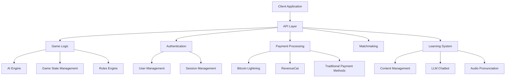
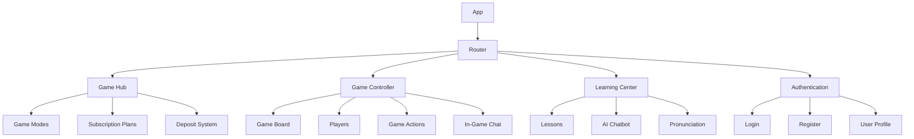
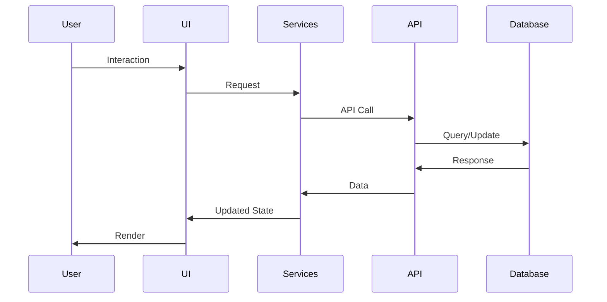
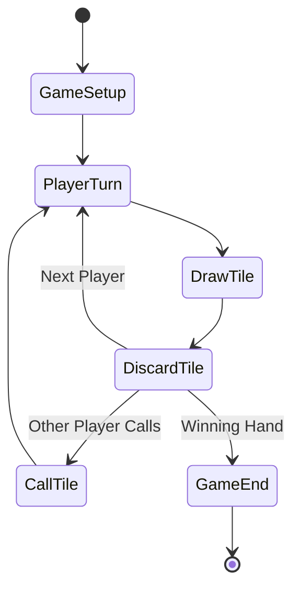

# MahCheungg Architecture (20apr2025-06h35)

## Overview

MahCheungg is a comprehensive online Cantonese Mahjong platform with multiple subscription tiers, AI opponents, multiplayer functionality, and an educational component. The architecture is designed to be modular, scalable, and maintainable, with clear separation of concerns.

## System Architecture

### High-Level Architecture

### Client Architecture

## Component Structure

The application follows a modular component structure organized by feature domains:

- **components/**: UI components
  - **auth/**: Authentication-related components
  - **game/**: Game-related components
  - **hub/**: Game hub components
  - **learn/**: Learning center components
  - **payment/**: Payment-related components
  - **ui/**: Shared UI components

- **contexts/**: React contexts for state management
  - **ThemeContext**: Manages application themes
  - **LanguageContext**: Manages internationalization

- **services/**: Service layer for external integrations
  - **WebLNService**: Bitcoin Lightning Network integration
  - **RevenueCatService**: Subscription management
  - **ChatbotService**: AI chatbot functionality
  - **SpeechService**: Voice recognition and synthesis
  - **AudioService**: Audio playback for Cantonese pronunciation

- **models/**: Data models and types
  - **player/**: Player-related models
  - **game/**: Game-related models

- **i18n/**: Internationalization resources
  - **translations.ts**: Translation strings

## Data Flow

## Key Technologies

- **Frontend**: React, TypeScript, TailwindCSS
- **State Management**: React Context API
- **Payments**: WebLN (Bitcoin Lightning), RevenueCat
- **AI**: LLM for chatbot, AI opponents
- **Audio**: Web Speech API, TTS (Orpheus/Kokoro)
- **Internationalization**: Custom i18n system
- **Networking**: WebSockets for real-time gameplay

## Subscription Tiers

1. **Free Trial / Teaching Mode**
   - Basic AI opponents
   - Limited game modes
   - Access to learning resources

2. **Standard Tier ($4.99/month)**
   - All free features
   - Local LAN play
   - Advanced AI opponents

3. **Premium Tier ($9.99/month)**
   - All standard features
   - Online matchmaking
   - Tournament access

## Theme System

The application supports multiple visual themes:

1. **DeepSite** (Default): Dark theme with purple accents
2. **Brutalist**: Minimalist, high-contrast design
3. **Skeuomorphic**: Realistic, textured design
4. **Retro**: Vintage, pixel-art style

Each theme has light and dark variants.

## Internationalization

The application supports multiple languages:

- English (en)
- Cantonese (zh-HK)
- Simplified Chinese (zh-CN)
- Japanese (ja)

## Learning System

The learning system consists of:

1. **Structured Lessons**: Categorized by rules, strategy, and terminology
2. **AI Chatbot**: Interactive LLM-powered tutor
3. **Audio Pronunciation**: TTS for Cantonese terms
4. **Voice Interaction**: Speech recognition for natural conversation

## Game Mechanics

## Security Considerations

- **Authentication**: Secure user authentication
- **Payment Processing**: Secure handling of payment information
- **Data Privacy**: Protection of user data
- **Anti-Cheating**: Measures to prevent cheating in multiplayer games

## Future Expansion

- **Mobile Applications**: Native mobile apps
- **Tournament System**: Organized competitive play
- **Social Features**: Friends, clans, leaderboards
- **Additional Game Variants**: Support for other Mahjong variants
