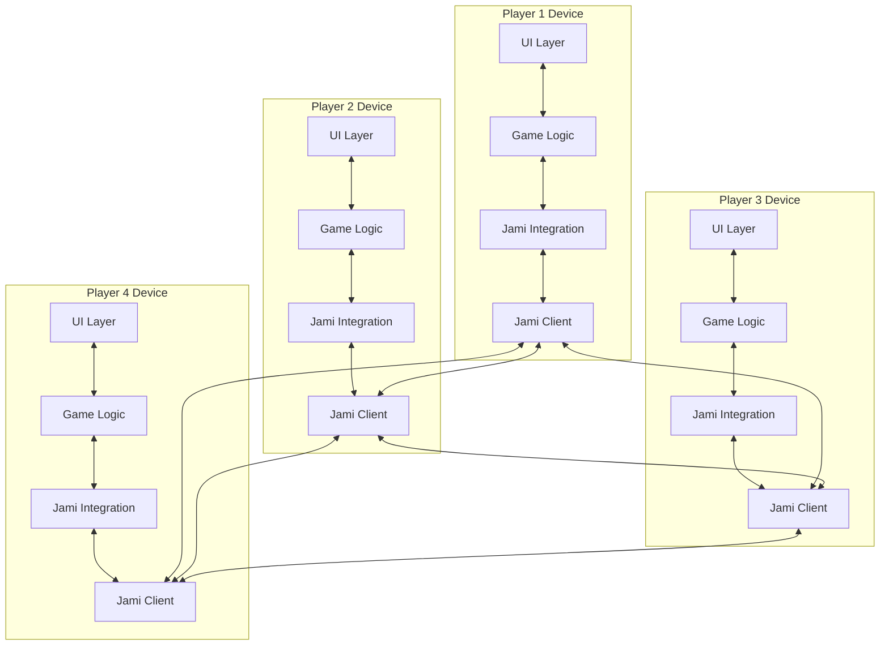
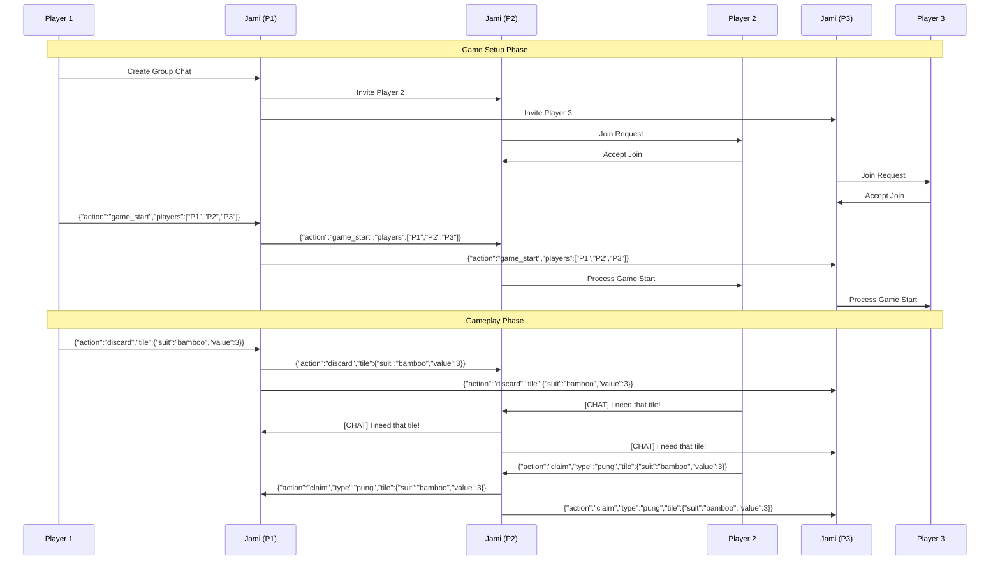

# MahCheungg Architecture: Jami-Based Distributed Game System

**Date:** 22apr2025-06h35
**Version:** 1.0
**Status:** Approved

## 1. Overview

MahCheungg is a distributed multiplayer Mahjong game that uses Jami's group chat functionality as a transport layer for game state. This document outlines the architecture of the system, focusing on the innovative approach of using messaging as a multicast mechanism for game state updates.

## 2. Core Architecture

### 2.1 System Architecture Diagram



### 2.2 Key Components

1. **Jami Integration Layer**: Provides an abstraction over the Jami SDK, handling group chat creation, invitations, and message sending/receiving.

2. **Game State Transport**: Manages the transmission and reception of game state updates, using Jami's group chat as a multicast mechanism.

3. **Turn Manager**: Implements a turn-based authority model where only the current player can send certain game actions, with fallback mechanisms for disconnections and timeouts.

4. **Vector Clock**: Provides distributed event ordering and conflict resolution, ensuring consistent game state across all players.

5. **Message Display**: Controls the visibility of game state messages in the chat interface, with a debug mode toggle for showing/hiding technical messages.

6. **Game Actions**: Defines the standard format for game state update messages, including setup, gameplay, and special actions.

## 3. Communication Protocol

### 3.1 Message Format

#### Game State Messages (Default)
```json
{
  "action": "discard",
  "player": "player1",
  "tile": {"suit": "bamboo", "value": 3},
  "vectorClock": "[['player1', 5], ['player2', 3], ['player3', 2], ['player4', 1]]",
  "timestamp": 1650123456789
}
```

#### Chat Messages (Marked)
```
[CHAT] Hello everyone, ready to play?
```

### 3.2 Message Flow



## 4. Component Details

### 4.1 Jami Integration Layer

The Jami Integration Layer is isolated in a service worker for better maintainability. It provides an abstraction over the Jami SDK, handling:

- Group chat creation and management
- Player invitations
- Message sending and receiving
- Connection monitoring and heartbeat system

```typescript
class JamiService {
  private static instance: JamiService;
  private groupChats: Map<string, GroupChat> = new Map();

  // Singleton pattern
  public static getInstance(): JamiService {
    if (!JamiService.instance) {
      JamiService.instance = new JamiService();
    }
    return JamiService.instance;
  }

  // Create a new game session (group chat)
  public async createGameSession(): Promise<string> {
    // Call Jami API to create a group chat
    const groupId = await this.createJamiGroupChat();
    this.groupChats.set(groupId, { id: groupId, members: [] });
    return groupId;
  }

  // Other methods...
}
```

### 4.2 Vector Clock Implementation

The Vector Clock component implements the vector clock algorithm for distributed event ordering and conflict resolution:

```typescript
class VectorClock {
  private clock: Map<string, number> = new Map();

  constructor(players: string[]) {
    // Initialize clock with zero for each player
    players.forEach(player => {
      this.clock.set(player, 0);
    });
  }

  public increment(playerId: string): void {
    const currentValue = this.clock.get(playerId) || 0;
    this.clock.set(playerId, currentValue + 1);
  }

  public compare(otherClock: VectorClock): 'before' | 'after' | 'concurrent' {
    // Implementation details...
  }

  // Other methods...
}
```

### 4.3 Turn Manager

The Turn Manager implements a turn-based authority model with fallback mechanisms for disconnections and timeouts:

```typescript
class TurnManager {
  private currentPlayerIndex: number = 0;
  private players: Player[] = [];
  private turnTimeout: number = 30000; // 30 seconds default
  private timeoutTimer: NodeJS.Timeout | null = null;

  // Methods for turn management, timeout handling, etc.
}
```

### 4.4 Message Display Controller

The Message Display Controller manages the visibility of game state messages in the chat interface:

```typescript
class MessageDisplayController {
  private debugMode: boolean = false;
  private chatContainer: HTMLElement;

  constructor(chatContainerId: string) {
    this.chatContainer = document.getElementById(chatContainerId) as HTMLElement;
  }

  public setDebugMode(enabled: boolean): void {
    this.debugMode = enabled;

    // Update visibility of existing game state messages
    const gameStateMessages = this.chatContainer.querySelectorAll('.game-state-message');
    gameStateMessages.forEach(msg => {
      (msg as HTMLElement).style.display = this.debugMode ? 'block' : 'none';
    });
  }

  // Other methods...
}
```

## 5. Game Actions

### 5.1 Game Setup Actions

```typescript
interface GameStartAction {
  action: 'game_start';
  players: string[];  // Player IDs in seating order
  options?: {
    includeBonus: boolean;
    timeLimit?: number;  // Time limit per turn in seconds
    rules?: string;      // Rule variation identifier
  };
}

interface DealAction {
  action: 'deal';
  tiles: {
    [playerId: string]: TileInfo[];  // Initial tiles for each player
  };
  remainingTiles: number;  // Number of tiles remaining in wall
}
```

### 5.2 Core Gameplay Actions

```typescript
interface DrawAction {
  action: 'draw';
  player: string;
  tile?: TileInfo;  // Only visible to the drawing player
  remainingTiles: number;
}

interface DiscardAction {
  action: 'discard';
  player: string;
  tile: TileInfo;
}

interface ClaimAction {
  action: 'claim';
  player: string;
  type: 'chow' | 'pung' | 'kong' | 'win';
  tile: TileInfo;
  set?: TileInfo[];  // For chow/pung/kong, the tiles used from hand
}

interface PassAction {
  action: 'pass';
  player: string;
  claimType?: 'chow' | 'pung' | 'kong' | 'win';  // What claim opportunity was passed
}
```

### 5.3 Special Actions

```typescript
interface KongRevealAction {
  action: 'kong_reveal';
  player: string;
  tile: TileInfo;
}

interface BonusTileAction {
  action: 'bonus_tile';
  player: string;
  tile: TileInfo;
  replacementTile?: TileInfo;  // Only visible to the player
}

interface GameEndAction {
  action: 'game_end';
  winner?: string;
  winType?: string;  // Type of win (e.g., 'self_draw', 'discard')
  points?: number;
  hands?: {
    [playerId: string]: {
      tiles: TileInfo[];
      sets: TileInfo[][];
      score: number;
    }
  };
}
```

## 6. Resilience Mechanisms

### 6.1 Player Disconnection Handling

The system includes several mechanisms for handling player disconnections:

1. **Heartbeat System**: Monitors player connections using periodic heartbeats.
2. **Emergency Handoff**: Transfers turn authority if the current player disconnects.
3. **Game Suspension**: Suspends the game if all players disconnect, with the ability to resume later.

### 6.2 Conflict Resolution

Vector clocks are used to resolve conflicts in distributed game state:

1. **Event Ordering**: Determines the correct order of events across all players.
2. **State Merging**: Merges concurrent changes in a consistent way.
3. **Reconnection Sync**: Ensures players who reconnect receive all missed updates in the correct order.

## 7. Extension Points

The architecture is designed to be extensible in several key ways:

1. **Additional Game Actions**: New game actions can be added by defining new action types and handlers.
2. **Enhanced Validation Rules**: The validation system can be extended with more sophisticated rules.
3. **Game State Persistence**: Add persistence to allow game recovery.
4. **Spectator Mode**: Support for spectators who can observe but not participate.
5. **AI Players**: Integration with AI players that can participate in the game.

## 8. Implementation Roadmap

1. **Phase 1: Core Integration**
   - Implement basic Jami service wrapper
   - Create game state transport layer
   - Implement essential game actions

2. **Phase 2: Game Logic**
   - Implement complete Mahjong rules
   - Add validation for all game actions
   - Create UI components for game display

3. **Phase 3: Enhanced Features**
   - Add support for game persistence
   - Implement spectator mode
   - Add AI players
   - Create advanced analytics and scoring

4. **Phase 4: Polish**
   - Add animations and sound effects
   - Implement internationalization
   - Add accessibility features
   - Performance optimization

## 9. Conclusion

The MahCheungg architecture leverages Jami's group chat functionality as an innovative transport layer for game state, creating a fully distributed multiplayer game without the need for a central server. This approach provides several advantages:

1. **Simplified Infrastructure**: No need for dedicated game servers.
2. **Built-in Communication**: Game state and player communication use the same channel.
3. **Resilience**: The system can handle player disconnections and network issues.
4. **Extensibility**: The architecture can be adapted to other turn-based games with minimal changes.

This document will be updated as the implementation progresses and additional details are finalized.
