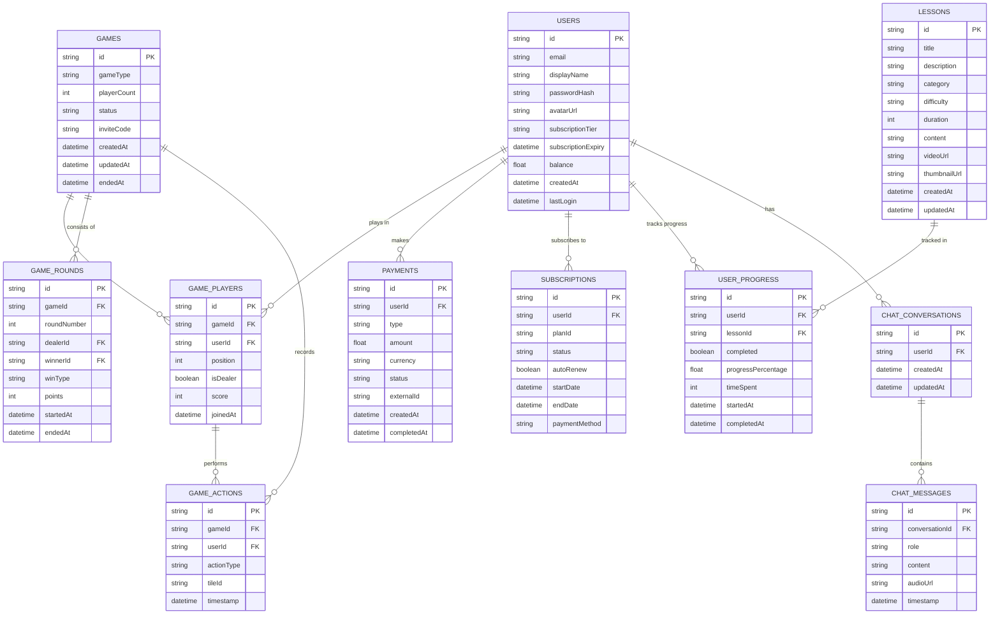

# MahCheungg Schematic Diagrams (20apr2025-06h35)

## System Architecture Diagram

## Component Diagram

## Data Flow Diagram

## Game State Diagram

## Deployment Architecture

## Database Schema

These diagrams provide a comprehensive overview of the MahCheungg application architecture, components, data flow, and database schema. They can be used as a reference for development and documentation purposes.
