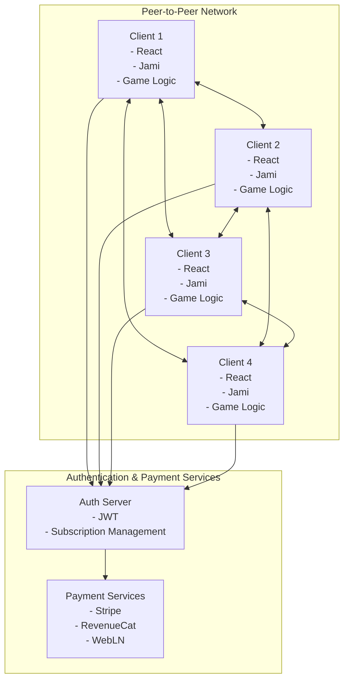

# MahCheungg Architecture

This document outlines the architecture for the MahCheungg game, focusing on creating a system that works with both AI and human players using the same connection interfaces.

## System Overview

MahCheungg is a digital implementation of the traditional Mahjong game with multiple subscription tiers:
- **Free Trial/Teaching Mode**: Limited functionality focused on learning
- **Standard Tier**: Local LAN play with AI and human players
- **Premium Tier**: Online matchmaking with similarly skilled players

## Core Components

### 1. Player Interface

The central architectural concept is a unified player interface that both human and AI players implement:

```typescript
interface Player {
  // Basic properties
  id: string;
  name: string;
  isAI: boolean;

  // Game state
  hand: Tile[];
  discardedTiles: Tile[];
  exposedSets: TileSet[];

  // Actions
  drawTile(tile: Tile): void;
  discardTile(tile: Tile): void;
  declarePung(tile: Tile): boolean;
  declareKong(tile: Tile): boolean;
  declareChow(tile: Tile, position: ChowPosition): boolean;
  declareMahjong(): boolean;

  // Decision making
  getDiscardDecision(): Promise<Tile>;
  getActionDecision(availableActions: GameAction[], discardedTile: Tile): Promise<GameAction | null>;

  // Communication
  sendMessage(message: string): void;
  receiveMessage(message: string, sender: Player): void;

  // Connection management
  connect(): Promise<boolean>;
  disconnect(): void;
  isConnected(): boolean;
}
```

This interface ensures that the game logic doesn't need to know whether it's interacting with a human or AI player.

### 2. Game Logic

The game logic manages:
- Game rules and validation
- Turn management
- Tile distribution
- Special actions (Chow, Pung, Kong, Mahjong)
- Scoring

### 3. Networking Layer

The networking layer leverages Jami for all communication needs:
- Jami multicast messaging for game state transport and synchronization
- Peer-to-peer connections eliminating the need for a central server
- LAN discovery for local play
- Embedded game state updates within conversation messages
- Resilient architecture with timeout fallbacks for disconnected players
- Conflict resolution using timestamps for game state synchronization

### 4. Subscription System

The subscription system manages:
- User authentication
- Subscription tier management
- Feature gating based on subscription level
- Payment processing (via Stripe)

### 5. Teaching Module

The teaching module includes:
- Progression system for different skill levels
- Interactive exercises
- Progress tracking
- Achievement system

## Technical Stack

- **Frontend**: React with TypeScript, Vite for build system
- **Styling**: Tailwind CSS
- **State Management**: Redux or Context API
- **Backend**: Minimal backend services for authentication and payment processing
- **Communication & Transport Layer**: Jami for text, voice, and video chat
- **Game State Transport**: Jami multicast messaging with embedded game state
- **Authentication**: JWT-based authentication
- **Payment Processing**: Stripe, RevenueCat, and WebLN for crypto payments

## Deployment Architecture



The architecture uses a peer-to-peer model where:

1. Each client contains the full game logic
2. Jami handles all communication and game state transport
3. Authentication and payment services are the only centralized components
4. Game state is synchronized through Jami's multicast messaging

## AI Player Design

AI players implement the same `Player` interface as human players but use algorithms for decision-making:

```typescript
class AIPlayer implements Player {
  difficulty: AIDifficulty;
  personality: AIPersonality;

  getDiscardDecision(): Promise<Tile> {
    // AI logic to choose a tile to discard based on:
    // - Current hand evaluation
    // - Difficulty level
    // - Personality traits (aggressive, defensive, etc.)
    // - Game state analysis
  }

  getActionDecision(availableActions: GameAction[], discardedTile: Tile): Promise<GameAction | null> {
    // AI logic to decide whether to perform an action based on:
    // - Action evaluation
    // - Risk assessment
    // - Difficulty level
    // - Personality traits
  }
}
```

## Communication System

The communication system is built entirely on Jami and supports:

- Text chat between players
- Voice chat for real-time communication
- Video chat for a more immersive experience
- Game state transport through multicast messaging

### Game State Transport

The innovative aspect of MahCheungg's architecture is using Jami not just for player communication but also as the transport layer for game state:

1. Game state updates are embedded within conversation text messages
2. Updates use special markup that can be hidden in normal gameplay
3. Game state messages are only visible in debug mode
4. The system uses multicast messaging to ensure all players receive state updates
5. Conflict resolution uses timestamps to handle network delays
6. Timeout fallbacks ensure resilience when players disconnect
7. The architecture follows modular design patterns that isolate Jami as a service

All communication is routed through the same interfaces regardless of player type, with AI players potentially using text-to-speech and speech recognition for voice interaction.

## Subscription Tier Features

### Free Trial/Teaching Mode

- Access to teaching modules
- Play against AI opponents
- Limited game features

### Standard Tier

- Full game features
- Local LAN play with friends
- Unlimited AI opponents with various difficulty levels
- Basic teaching modules

### Premium Tier

- All standard features
- Online matchmaking with skill-based pairing
- Advanced teaching modules
- Statistics and performance tracking
- Tournament access
